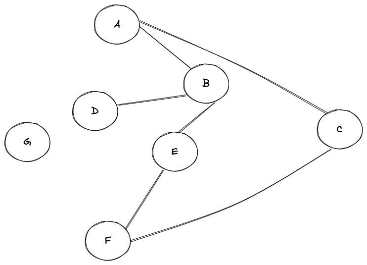

## Statement
Most Esteemed Solver,

We bid you a warm welcome to our humble digital parlor, a realm where minds are sharpened and wits are tested. As the cogs and gears of progress turn ever forward, we find ourselves on the cusp of an era filled with remarkable intellectual challenges, a world once only imagined by the likes of Verne and Wells.

Our first contest of intellect finds its roots not in the hustle and bustle of the steam-powered metropolis, but in the serene tranquility of the heavens above. Imagine, if you will, a celestial chart – a glorious tapestry of constellations, _each star linked to the other by invisible threads of cosmic influence_. A moment's observation reveals not a random spattering of lights, but a grand network of celestial bodies, each intimately connected in a waltz as old as time itself.

*The challenge set before you, dear solver, is to play the role of an intrepid 19th-century astronomer, peering through your telescope into the cosmos. Your task begins with a single star - the starting point in a journey through the interconnected constellation. Your assignment, simply put, is to uncover all the connections that radiate outwards from this initial point.*

Our instrument of choice is not the sextant nor the astrolabe, but a modern contraption referred to as Clojure – a remarkable language of computing that sings with the elegance of a well-tuned pocket watch. Your mission, should you choose to accept it, is to create an algorithmic mechanism using this ingenious language to traverse the star chart. It must trace all the connecting pathways, starting from a given celestial body, and return these routes so that we might map the stars.

We request the utmost attention to detail, as even a minor error may send you astray into the boundless void. Should you prove successful, the glory of unlocking the universe's secrets, and the admiration of your fellow intellectual explorers, shall be your reward.

We eagerly await the result of your endeavor. Take courage, for the stars themselves look down upon you and are steadfast in their silent encouragement.

Yours in the pursuit of knowledge,

The Webmaster of this Digital Athenaeum
---------------------------------------------------------------------------------
#### Example




##### Input
```
(def graph {:a [:b :c]
            :b [:a :d :e]
            :c [:a :f]
            :d [:b]
            :e [:b :f]
            :f [:c :e]
            :g []})

(answer [graph :a])
```

##### Output
```
#{:a :b :c :d :e :f})
```

##### Input
```
(def graph {:a [:b :c]
            :b [:a :d :e]
            :c [:a :f]
            :d [:b]
            :e [:b :f]
            :f [:c :e]
            :g []})

(answer [graph :g])
```

##### Output
```
#{}
```


#### Code example
```
(defn answer
  [graph starting-point]
  YOUR CODE GOES HERE)
```


